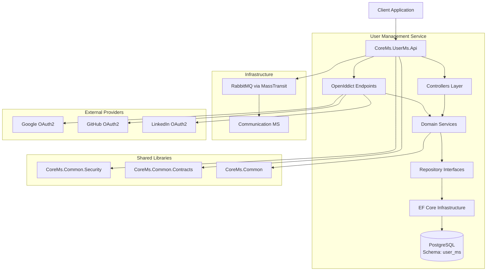
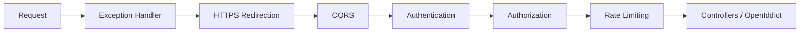
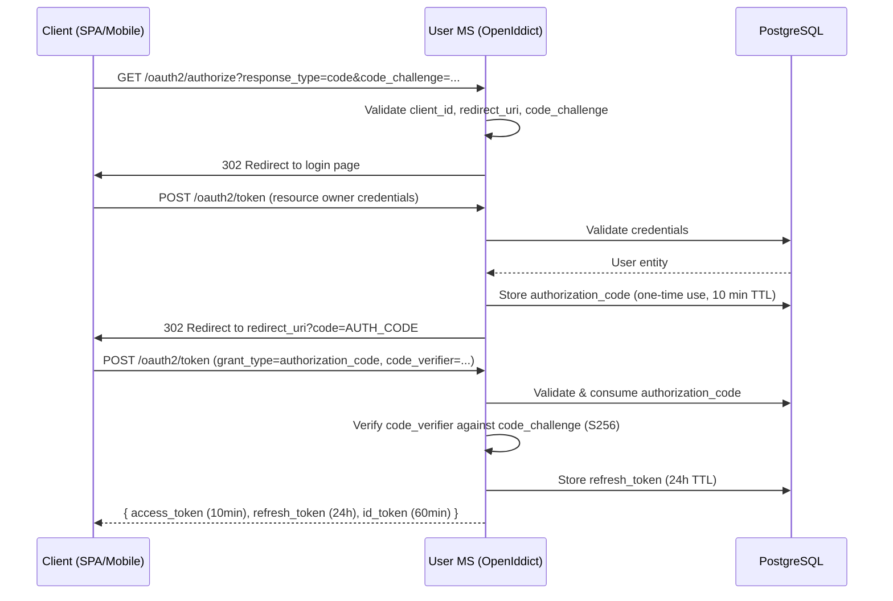
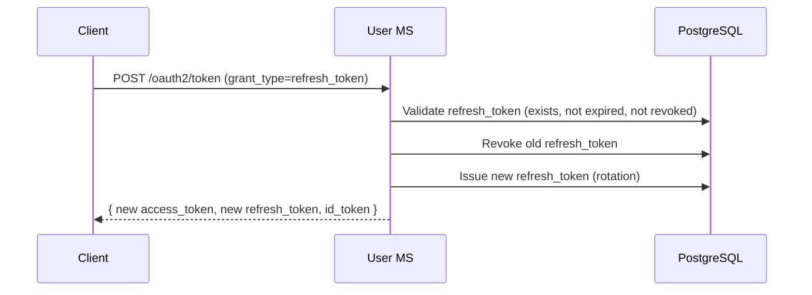
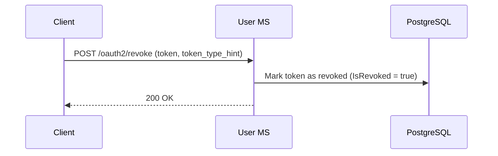
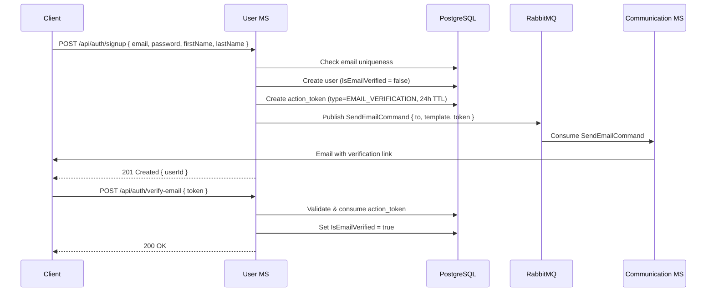
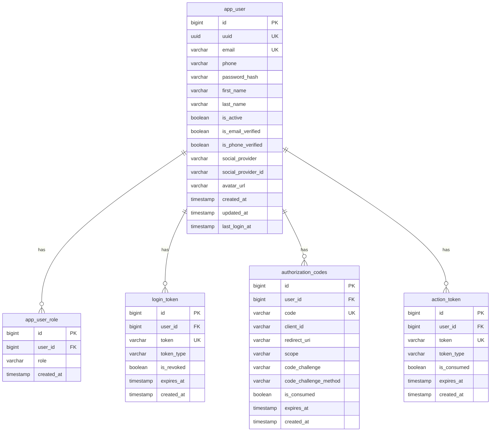

# Design Document: User Management Service C# Migration

## Overview

This document defines the technical design for a **1:1 migration** of the existing Java Spring Boot User Management Service (user-ms) to C# / ASP.NET Core 9. This is a translation, not a reinvention — the goal is to preserve the same service structure, API contracts, database schema, and business logic while adopting idiomatic .NET patterns.

**What stays the same:**
- Same API endpoints and HTTP contracts (paths, methods, request/response shapes, status codes)
- Same PostgreSQL database schema (`user_ms`) — EF Core maps to the existing tables
- Same service class responsibilities (UserService, AuthService, TokenService)
- Same business logic and validation rules
- Same messaging contracts (SendEmailCommand to Communication MS)

**What changes (language/framework idioms only):**
- Java → C#, Spring Boot → ASP.NET Core 9
- Spring Security OAuth2 Server → OpenIddict (embedded OAuth2/OIDC provider)
- JPA/Hibernate → Entity Framework Core 9
- Spring AMQP → MassTransit (RabbitMQ transport)
- Virtual Threads → async/await
- application.yml → appsettings.json + Options pattern
- Maven → MSBuild with Directory.Build.props / Directory.Packages.props
- Docker Compose dev setup → .NET Aspire for local orchestration

The service is a single deployable unit containing three domain service classes:
- **UserService** — handles user registration, profile updates, and admin CRUD operations
- **AuthService** — handles credential validation, email/phone verification, and password operations
- **TokenService** — handles refresh token lifecycle (creation, validation, revocation, cleanup)

These are classes within the same ASP.NET Core application (user-ms), not separate microservices. They are registered in DI and injected into controllers as needed.

The service handles: OAuth2/OIDC flows (authorization code + PKCE, refresh token rotation, token revocation), user registration with email/phone verification, password management, role-based access control (RBAC), social OAuth2 login (Google, GitHub, LinkedIn), admin user CRUD, and a searchable user directory.

## Architecture

### Multi-Repo Solution Structure

The system uses a **multi-repo architecture** where `corems-parent` is the orchestrator repository and each microservice lives in its own Git repository. Service repos are cloned into the `src/` folder during setup.

```
corems-parent/                              ← Orchestrator repo (GitHub)
├── src/
│   ├── Common/                             ← Shared libs (in this repo, published as NuGet)
│   │   ├── CoreMs.Common/                  # Base classes, utilities, PagedResult<T>
│   │   ├── CoreMs.Common.Contracts/        # Shared DTOs (C# records), Contracts
│   │   └── CoreMs.Common.Security/         # JWT validation, ICurrentUserService, RBAC
│   ├── Aspire/
│   │   ├── CoreMs.AppHost/                 # .NET Aspire orchestrator
│   │   └── CoreMs.ServiceDefaults/         # Shared service configuration
│   ├── user-ms/                            ← Cloned from separate repo
│   │   ├── src/
│   │   │   ├── CoreMs.UserMs.Api/          # ASP.NET Core host, controllers, OpenIddict config
│   │   │   ├── CoreMs.UserMs.Domain/       # Entities, interfaces, services, enums
│   │   │   └── CoreMs.UserMs.Infrastructure/ # EF Core, repositories, migrations
│   │   ├── tests/
│   │   │   ├── CoreMs.UserMs.Tests/        # Unit tests (xUnit)
│   │   │   └── CoreMs.UserMs.IntegrationTests/ # Integration tests (Testcontainers)
│   │   └── README.md
│   ├── communication-ms/                   ← Cloned from separate repo
│   ├── document-ms/                        ← Cloned from separate repo
│   ├── translation-ms/                     ← Cloned from separate repo
│   └── template-ms/                        ← Cloned from separate repo
├── docker/
│   └── docker-compose.infra.yml            # Fallback if not using Aspire
├── CoreMs.sln                              # References ALL projects across repos
├── Directory.Build.props                   # Shared build properties
├── Directory.Packages.props                # Central package management
├── setup.ps1                               # Clone repos, restore, build
└── .kiro/
```

**Key principles:**
- `corems-parent` owns: Common libraries, Aspire orchestration, .sln, build props, setup script, docker fallback
- Each service repo owns: its own src/, tests/, README, and can be built/tested independently
- The .sln file references projects across repo boundaries (relative paths into `src/{service}/`)
- Common libraries are referenced as project references locally, published as NuGet for CI/CD isolation

### Component Diagram



### Middleware Pipeline Order



## Authentication & Authorization Flows

### Authorization Code + PKCE Flow



### Refresh Token Rotation Flow



### Token Revocation Flow (RFC 7009)



### Registration & Verification Flow



## Components and Interfaces

### Layer Responsibilities

| Layer | Project | Path | Responsibility |
|-------|---------|------|---------------|
| API | CoreMs.UserMs.Api | `src/user-ms/src/CoreMs.UserMs.Api/` | HTTP endpoints, OpenIddict config, DI registration, middleware |
| Domain | CoreMs.UserMs.Domain | `src/user-ms/src/CoreMs.UserMs.Domain/` | Entities, service interfaces, repository interfaces, business logic, enums |
| Infrastructure | CoreMs.UserMs.Infrastructure | `src/user-ms/src/CoreMs.UserMs.Infrastructure/` | EF Core DbContext, repository implementations, migrations |

### Controller Interfaces

```csharp
// OAuth2/OIDC — handled by OpenIddict with custom authorization/token handlers
// Discovery & JWKS are auto-served by OpenIddict

[ApiController]
[Route("api/auth")]
public class AuthController : ControllerBase
{
    [HttpPost("signup")]
    public async Task<ActionResult<UserCreatedDto>> SignUp(
        SignUpRequest request, CancellationToken ct);

    [HttpPost("verify-email")]
    public async Task<IActionResult> VerifyEmail(
        VerifyEmailRequest request, CancellationToken ct);

    [HttpPost("verify-phone")]
    public async Task<IActionResult> VerifyPhone(
        VerifyPhoneRequest request, CancellationToken ct);

    [HttpPost("resend-verification")]
    public async Task<IActionResult> ResendVerification(
        ResendVerificationRequest request, CancellationToken ct);

    [HttpPost("forgot-password")]
    public async Task<IActionResult> ForgotPassword(
        ForgotPasswordRequest request, CancellationToken ct);

    [HttpPost("reset-password")]
    public async Task<IActionResult> ResetPassword(
        ResetPasswordRequest request, CancellationToken ct);
}

[ApiController]
[Route("api/profile")]
[Authorize]
public class ProfileController : ControllerBase
{
    [HttpPatch]
    public async Task<ActionResult<UserInfoDto>> UpdateProfile(
        UpdateProfileRequest request, CancellationToken ct);

    [HttpPost("change-password")]
    public async Task<IActionResult> ChangePassword(
        ChangePasswordRequest request, CancellationToken ct);
}

[ApiController]
[Route("api/users")]
[Authorize(Roles = $"{CoreMsRoles.UserMsAdmin},{CoreMsRoles.SuperAdmin}")]
public class UsersController : ControllerBase
{
    [HttpGet]
    public async Task<ActionResult<PagedResult<UserInfoDto>>> GetUsers(
        [FromQuery] QueryParameters parameters, CancellationToken ct);

    [HttpPost]
    public async Task<ActionResult<UserInfoDto>> CreateUser(
        CreateUserRequest request, CancellationToken ct);

    [HttpGet("{userId:guid}")]
    public async Task<ActionResult<UserInfoDto>> GetUser(
        Guid userId, CancellationToken ct);

    [HttpPut("{userId:guid}")]
    public async Task<ActionResult<UserInfoDto>> UpdateUser(
        Guid userId, UpdateUserRequest request, CancellationToken ct);

    [HttpDelete("{userId:guid}")]
    public async Task<IActionResult> DeleteUser(
        Guid userId, CancellationToken ct);

    [HttpPost("{userId:guid}/change-password")]
    public async Task<IActionResult> AdminChangePassword(
        Guid userId, AdminChangePasswordRequest request, CancellationToken ct);

    [HttpPost("{userId:guid}/change-email")]
    public async Task<IActionResult> AdminChangeEmail(
        Guid userId, AdminChangeEmailRequest request, CancellationToken ct);
}
```

### Domain Service Interfaces

These are domain service classes within user-ms (not separate microservices). They mirror the Java project's service structure: `UserService`, `AuthService`, and `TokenService` — just translated to idiomatic C# with interface-based DI.

```csharp
public interface IUserService
{
    Task<UserEntity> CreateUserAsync(SignUpRequest request, CancellationToken ct = default);
    Task<UserInfoDto> GetUserByUuidAsync(Guid uuid, CancellationToken ct = default);
    Task<UserInfoDto> UpdateProfileAsync(Guid uuid, UpdateProfileRequest request, CancellationToken ct = default);
    Task<PagedResult<UserInfoDto>> GetUsersPagedAsync(QueryParameters parameters, CancellationToken ct = default);
    Task<UserInfoDto> AdminCreateUserAsync(CreateUserRequest request, CancellationToken ct = default);
    Task<UserInfoDto> AdminUpdateUserAsync(Guid uuid, UpdateUserRequest request, CancellationToken ct = default);
    Task DeleteUserAsync(Guid uuid, CancellationToken ct = default);
}

public interface IAuthService
{
    Task<UserEntity> ValidateCredentialsAsync(string email, string password, CancellationToken ct = default);
    Task VerifyEmailAsync(string token, CancellationToken ct = default);
    Task VerifyPhoneAsync(string token, CancellationToken ct = default);
    Task ResendVerificationAsync(string email, string type, CancellationToken ct = default);
    Task InitiatePasswordResetAsync(string email, CancellationToken ct = default);
    Task ResetPasswordAsync(string token, string newPassword, CancellationToken ct = default);
    Task ChangePasswordAsync(Guid userUuid, string currentPassword, string newPassword, CancellationToken ct = default);
    Task AdminChangePasswordAsync(Guid userUuid, string newPassword, CancellationToken ct = default);
    Task AdminChangeEmailAsync(Guid userUuid, string newEmail, CancellationToken ct = default);
}

public interface ITokenService
{
    Task<LoginTokenEntity> CreateRefreshTokenAsync(UserEntity user, CancellationToken ct = default);
    Task<LoginTokenEntity?> ValidateRefreshTokenAsync(string token, CancellationToken ct = default);
    Task RevokeRefreshTokenAsync(string token, CancellationToken ct = default);
    Task RevokeAllUserTokensAsync(long userId, CancellationToken ct = default);
    Task CleanupExpiredTokensAsync(CancellationToken ct = default);
}

public interface ISocialAuthService
{
    Task<UserEntity> HandleSocialLoginAsync(string provider, ExternalLoginInfo info, CancellationToken ct = default);
}
```

### Repository Interfaces

```csharp
public interface IUserRepository
{
    Task<UserEntity?> GetByIdAsync(long id, CancellationToken ct = default);
    Task<UserEntity?> GetByUuidAsync(Guid uuid, CancellationToken ct = default);
    Task<UserEntity?> GetByEmailAsync(string email, CancellationToken ct = default);
    Task<bool> ExistsByEmailAsync(string email, CancellationToken ct = default);
    Task<bool> ExistsByPhoneAsync(string phone, CancellationToken ct = default);
    Task<UserEntity> AddAsync(UserEntity entity, CancellationToken ct = default);
    Task UpdateAsync(UserEntity entity, CancellationToken ct = default);
    Task DeleteAsync(UserEntity entity, CancellationToken ct = default);
    Task<PagedResult<UserEntity>> GetPagedAsync(QueryParameters parameters, CancellationToken ct = default);
}

public interface ILoginTokenRepository
{
    Task<LoginTokenEntity?> GetByTokenAsync(string token, CancellationToken ct = default);
    Task<LoginTokenEntity> AddAsync(LoginTokenEntity entity, CancellationToken ct = default);
    Task UpdateAsync(LoginTokenEntity entity, CancellationToken ct = default);
    Task RevokeAllByUserIdAsync(long userId, CancellationToken ct = default);
    Task DeleteExpiredTokensAsync(CancellationToken ct = default);
}

public interface IActionTokenRepository
{
    Task<ActionTokenEntity?> GetByTokenAsync(string token, CancellationToken ct = default);
    Task<ActionTokenEntity> AddAsync(ActionTokenEntity entity, CancellationToken ct = default);
    Task ConsumeAsync(ActionTokenEntity entity, CancellationToken ct = default);
    Task DeleteExpiredTokensAsync(CancellationToken ct = default);
}

public interface IAuthorizationCodeRepository
{
    Task<AuthorizationCodeEntity?> GetByCodeAsync(string code, CancellationToken ct = default);
    Task<AuthorizationCodeEntity> AddAsync(AuthorizationCodeEntity entity, CancellationToken ct = default);
    Task ConsumeAsync(AuthorizationCodeEntity entity, CancellationToken ct = default);
    Task DeleteExpiredCodesAsync(CancellationToken ct = default);
}
```

## Data Models

### Entity Relationship Diagram



### Entity Definitions

```csharp
public class UserEntity
{
    public long Id { get; set; }
    public Guid Uuid { get; set; } = Guid.NewGuid();
    public string Email { get; set; } = string.Empty;
    public string? Phone { get; set; }
    public string PasswordHash { get; set; } = string.Empty;
    public string? FirstName { get; set; }
    public string? LastName { get; set; }
    public bool IsActive { get; set; } = true;
    public bool IsEmailVerified { get; set; }
    public bool IsPhoneVerified { get; set; }
    public string? SocialProvider { get; set; }
    public string? SocialProviderId { get; set; }
    public string? AvatarUrl { get; set; }
    public DateTime CreatedAt { get; set; }
    public DateTime UpdatedAt { get; set; }
    public DateTime? LastLoginAt { get; set; }

    // Navigation properties
    public ICollection<UserRoleEntity> Roles { get; set; } = new List<UserRoleEntity>();
    public ICollection<LoginTokenEntity> LoginTokens { get; set; } = new List<LoginTokenEntity>();
    public ICollection<ActionTokenEntity> ActionTokens { get; set; } = new List<ActionTokenEntity>();
}

public class UserRoleEntity
{
    public long Id { get; set; }
    public long UserId { get; set; }
    public string Role { get; set; } = string.Empty;
    public DateTime CreatedAt { get; set; }

    // Navigation
    public UserEntity User { get; set; } = null!;
}

public class LoginTokenEntity
{
    public long Id { get; set; }
    public long UserId { get; set; }
    public string Token { get; set; } = string.Empty;
    public string TokenType { get; set; } = string.Empty; // REFRESH, ACCESS
    public bool IsRevoked { get; set; }
    public DateTime ExpiresAt { get; set; }
    public DateTime CreatedAt { get; set; }

    // Navigation
    public UserEntity User { get; set; } = null!;
}

public class AuthorizationCodeEntity
{
    public long Id { get; set; }
    public long UserId { get; set; }
    public string Code { get; set; } = string.Empty;
    public string ClientId { get; set; } = string.Empty;
    public string RedirectUri { get; set; } = string.Empty;
    public string? Scope { get; set; }
    public string? CodeChallenge { get; set; }
    public string? CodeChallengeMethod { get; set; }
    public bool IsConsumed { get; set; }
    public DateTime ExpiresAt { get; set; }
    public DateTime CreatedAt { get; set; }

    // Navigation
    public UserEntity User { get; set; } = null!;
}

public class ActionTokenEntity
{
    public long Id { get; set; }
    public long UserId { get; set; }
    public string Token { get; set; } = string.Empty;
    public ActionTokenType TokenType { get; set; }
    public bool IsConsumed { get; set; }
    public DateTime ExpiresAt { get; set; }
    public DateTime CreatedAt { get; set; }

    // Navigation
    public UserEntity User { get; set; } = null!;
}

public enum ActionTokenType
{
    EmailVerification,
    PhoneVerification,
    PasswordReset
}
```

### EF Core Entity Configuration

```csharp
public class UserEntityConfiguration : IEntityTypeConfiguration<UserEntity>
{
    public void Configure(EntityTypeBuilder<UserEntity> builder)
    {
        builder.ToTable("app_user", "user_ms");

        builder.HasKey(e => e.Id);
        builder.Property(e => e.Id).UseIdentityAlwaysColumn();

        builder.HasIndex(e => e.Uuid).IsUnique();
        builder.HasIndex(e => e.Email).IsUnique();
        builder.HasIndex(e => e.Phone).IsUnique().HasFilter("phone IS NOT NULL");

        builder.Property(e => e.Email).IsRequired().HasMaxLength(255);
        builder.Property(e => e.PasswordHash).IsRequired().HasMaxLength(512);
        builder.Property(e => e.FirstName).HasMaxLength(100);
        builder.Property(e => e.LastName).HasMaxLength(100);
        builder.Property(e => e.Phone).HasMaxLength(20);
        builder.Property(e => e.SocialProvider).HasMaxLength(50);
        builder.Property(e => e.SocialProviderId).HasMaxLength(255);
        builder.Property(e => e.AvatarUrl).HasMaxLength(1024);

        builder.Property(e => e.IsActive).IsRequired().HasDefaultValue(true);
        builder.Property(e => e.IsEmailVerified).IsRequired().HasDefaultValue(false);
        builder.Property(e => e.IsPhoneVerified).IsRequired().HasDefaultValue(false);

        builder.Property(e => e.CreatedAt).IsRequired().HasDefaultValueSql("NOW()");
        builder.Property(e => e.UpdatedAt).IsRequired().HasDefaultValueSql("NOW()");

        builder.HasMany(e => e.Roles)
            .WithOne(r => r.User)
            .HasForeignKey(r => r.UserId)
            .OnDelete(DeleteBehavior.Cascade);

        builder.HasMany(e => e.LoginTokens)
            .WithOne(t => t.User)
            .HasForeignKey(t => t.UserId)
            .OnDelete(DeleteBehavior.Cascade);

        builder.HasMany(e => e.ActionTokens)
            .WithOne(t => t.User)
            .HasForeignKey(t => t.UserId)
            .OnDelete(DeleteBehavior.Cascade);
    }
}

public class LoginTokenEntityConfiguration : IEntityTypeConfiguration<LoginTokenEntity>
{
    public void Configure(EntityTypeBuilder<LoginTokenEntity> builder)
    {
        builder.ToTable("login_token", "user_ms");

        builder.HasKey(e => e.Id);
        builder.Property(e => e.Id).UseIdentityAlwaysColumn();

        builder.HasIndex(e => e.Token).IsUnique();
        builder.HasIndex(e => new { e.UserId, e.IsRevoked });

        builder.Property(e => e.Token).IsRequired().HasMaxLength(512);
        builder.Property(e => e.TokenType).IsRequired().HasMaxLength(20);
        builder.Property(e => e.IsRevoked).IsRequired().HasDefaultValue(false);
        builder.Property(e => e.ExpiresAt).IsRequired();
        builder.Property(e => e.CreatedAt).IsRequired().HasDefaultValueSql("NOW()");
    }
}

public class ActionTokenEntityConfiguration : IEntityTypeConfiguration<ActionTokenEntity>
{
    public void Configure(EntityTypeBuilder<ActionTokenEntity> builder)
    {
        builder.ToTable("action_token", "user_ms");

        builder.HasKey(e => e.Id);
        builder.Property(e => e.Id).UseIdentityAlwaysColumn();

        builder.HasIndex(e => e.Token).IsUnique();

        builder.Property(e => e.Token).IsRequired().HasMaxLength(512);
        builder.Property(e => e.TokenType).IsRequired()
            .HasConversion<string>().HasMaxLength(30);
        builder.Property(e => e.IsConsumed).IsRequired().HasDefaultValue(false);
        builder.Property(e => e.ExpiresAt).IsRequired();
        builder.Property(e => e.CreatedAt).IsRequired().HasDefaultValueSql("NOW()");
    }
}

public class AuthorizationCodeEntityConfiguration : IEntityTypeConfiguration<AuthorizationCodeEntity>
{
    public void Configure(EntityTypeBuilder<AuthorizationCodeEntity> builder)
    {
        builder.ToTable("authorization_codes", "user_ms");

        builder.HasKey(e => e.Id);
        builder.Property(e => e.Id).UseIdentityAlwaysColumn();

        builder.HasIndex(e => e.Code).IsUnique();

        builder.Property(e => e.Code).IsRequired().HasMaxLength(512);
        builder.Property(e => e.ClientId).IsRequired().HasMaxLength(255);
        builder.Property(e => e.RedirectUri).IsRequired().HasMaxLength(1024);
        builder.Property(e => e.Scope).HasMaxLength(512);
        builder.Property(e => e.CodeChallenge).HasMaxLength(512);
        builder.Property(e => e.CodeChallengeMethod).HasMaxLength(10);
        builder.Property(e => e.IsConsumed).IsRequired().HasDefaultValue(false);
        builder.Property(e => e.ExpiresAt).IsRequired();
        builder.Property(e => e.CreatedAt).IsRequired().HasDefaultValueSql("NOW()");
    }
}
```

### DbContext

```csharp
public class UserMsDbContext : DbContext
{
    public UserMsDbContext(DbContextOptions<UserMsDbContext> options) : base(options) { }

    public DbSet<UserEntity> Users => Set<UserEntity>();
    public DbSet<UserRoleEntity> UserRoles => Set<UserRoleEntity>();
    public DbSet<LoginTokenEntity> LoginTokens => Set<LoginTokenEntity>();
    public DbSet<ActionTokenEntity> ActionTokens => Set<ActionTokenEntity>();
    public DbSet<AuthorizationCodeEntity> AuthorizationCodes => Set<AuthorizationCodeEntity>();

    protected override void OnModelCreating(ModelBuilder modelBuilder)
    {
        modelBuilder.HasDefaultSchema("user_ms");
        modelBuilder.ApplyConfigurationsFromAssembly(typeof(UserMsDbContext).Assembly);
    }

    public override Task<int> SaveChangesAsync(CancellationToken ct = default)
    {
        foreach (var entry in ChangeTracker.Entries<UserEntity>())
        {
            if (entry.State == EntityState.Modified)
                entry.Entity.UpdatedAt = DateTime.UtcNow;
        }
        return base.SaveChangesAsync(ct);
    }
}
```

## OpenIddict Configuration

### Registration in Program.cs

```csharp
builder.Services.AddOpenIddict()
    .AddCore(options =>
    {
        options.UseEntityFrameworkCore()
            .UseDbContext<UserMsDbContext>();
    })
    .AddServer(options =>
    {
        // Enable flows
        options.AllowAuthorizationCodeFlow()
            .AllowRefreshTokenFlow()
            .AllowClientCredentialsFlow();

        // Enable PKCE requirement
        options.RequireProofKeyForCodeExchange();

        // Token endpoints
        options.SetAuthorizationEndpointUris("/oauth2/authorize")
            .SetTokenEndpointUris("/oauth2/token")
            .SetRevocationEndpointUris("/oauth2/revoke")
            .SetUserinfoEndpointUris("/oauth2/userinfo")
            .SetConfigurationEndpointUris("/.well-known/openid-configuration")
            .SetCryptographyEndpointUris("/.well-known/jwks.json");

        // Token lifetimes
        options.SetAccessTokenLifetime(TimeSpan.FromMinutes(10))
            .SetRefreshTokenLifetime(TimeSpan.FromHours(24))
            .SetIdentityTokenLifetime(TimeSpan.FromMinutes(60))
            .SetAuthorizationCodeLifetime(TimeSpan.FromMinutes(10));

        // Signing & encryption
        options.AddSigningKey(signingKey)    // RS256 for production
            .AddEncryptionKey(encryptionKey);

        // Register ASP.NET Core host
        options.UseAspNetCore()
            .EnableAuthorizationEndpointPassthrough()
            .EnableTokenEndpointPassthrough()
            .EnableRevocationEndpointPassthrough()
            .EnableUserinfoEndpointPassthrough();

        // Refresh token rotation
        options.SetRefreshTokenReuseLeeway(TimeSpan.Zero); // No reuse — strict rotation
    })
    .AddValidation(options =>
    {
        options.UseLocalServer();
        options.UseAspNetCore();
    });
```

### OpenIddict Authorization Controller

```csharp
public class AuthorizationController : Controller
{
    /// Handles GET /oauth2/authorize — validates client, shows consent/login
    [HttpGet("~/oauth2/authorize")]
    [HttpPost("~/oauth2/authorize")]
    public async Task<IActionResult> Authorize(CancellationToken ct)
    {
        var request = HttpContext.GetOpenIddictServerRequest()
            ?? throw new InvalidOperationException("OpenIddict request not available.");

        // Validate client_id, redirect_uri, scope
        // If user not authenticated → redirect to login
        // If authenticated → create authorization code, redirect back
    }

    /// Handles POST /oauth2/token — exchanges code/refresh for tokens
    [HttpPost("~/oauth2/token")]
    public async Task<IActionResult> Exchange(CancellationToken ct)
    {
        var request = HttpContext.GetOpenIddictServerRequest()
            ?? throw new InvalidOperationException("OpenIddict request not available.");

        if (request.IsAuthorizationCodeGrantType())
        {
            // Validate code, verify PKCE, issue tokens
        }
        else if (request.IsRefreshTokenGrantType())
        {
            // Validate refresh token, rotate, issue new tokens
        }
        else if (request.IsClientCredentialsGrantType())
        {
            // Validate client credentials, issue access token
        }
    }

    /// Handles POST /oauth2/revoke — revokes refresh/access tokens
    [HttpPost("~/oauth2/revoke")]
    public async Task<IActionResult> Revoke(CancellationToken ct)
    {
        // Mark token as revoked in database
    }

    /// Handles GET /oauth2/userinfo — returns authenticated user claims
    [HttpGet("~/oauth2/userinfo")]
    [HttpPost("~/oauth2/userinfo")]
    [Authorize(AuthenticationSchemes = OpenIddictValidationAspNetCoreDefaults.AuthenticationScheme)]
    public async Task<IActionResult> Userinfo(CancellationToken ct)
    {
        // Return user claims from authenticated principal
    }
}
```

## DTO Contracts (C# Records)

```csharp
// Shared in CoreMs.Common.Contracts or UserMs.Api/Contracts

// --- Requests ---
public record SignUpRequest(
    string Email,
    string Password,
    string? FirstName,
    string? LastName,
    string? Phone);

public record VerifyEmailRequest(string Token);
public record VerifyPhoneRequest(string Token);
public record ResendVerificationRequest(string Email, string Type);
public record ForgotPasswordRequest(string Email);
public record ResetPasswordRequest(string Token, string NewPassword);
public record ChangePasswordRequest(string CurrentPassword, string NewPassword);
public record AdminChangePasswordRequest(string NewPassword);
public record AdminChangeEmailRequest(string NewEmail);

public record UpdateProfileRequest(
    string? FirstName,
    string? LastName,
    string? Phone,
    string? AvatarUrl);

public record CreateUserRequest(
    string Email,
    string Password,
    string? FirstName,
    string? LastName,
    string? Phone,
    List<string>? Roles);

public record UpdateUserRequest(
    string? FirstName,
    string? LastName,
    string? Phone,
    bool? IsActive,
    List<string>? Roles);

// --- Responses ---
public record UserCreatedDto(Guid UserId, string Email);

public record UserInfoDto(
    Guid UserId,
    string Email,
    string? FirstName,
    string? LastName,
    string? Phone,
    bool IsActive,
    bool IsEmailVerified,
    bool IsPhoneVerified,
    string? AvatarUrl,
    List<string> Roles,
    DateTime CreatedAt,
    DateTime UpdatedAt,
    DateTime? LastLoginAt);
```

## Configuration (Options Pattern)

### Strongly-Typed Configuration Classes

```csharp
public class JwtOptions
{
    public const string SectionName = "Jwt";

    public string Algorithm { get; set; } = "HS256";
    public string Issuer { get; set; } = string.Empty;
    public string Audience { get; set; } = "corems";
    public string KeyId { get; set; } = "corems-1";
    public string SecretKey { get; set; } = string.Empty;   // HS256
    public string PrivateKey { get; set; } = string.Empty;  // RS256
    public string PublicKey { get; set; } = string.Empty;   // RS256
    public int AccessTokenExpirationMinutes { get; set; } = 10;
    public int RefreshTokenExpirationMinutes { get; set; } = 1440;
    public int IdTokenExpirationMinutes { get; set; } = 60;
    public int AuthorizationCodeExpirationMinutes { get; set; } = 10;
}

public class OAuth2ClientOptions
{
    public const string SectionName = "OAuth2Clients";

    public List<ClientRegistration> Clients { get; set; } = new();
}

public class ClientRegistration
{
    public string ClientId { get; set; } = string.Empty;
    public string? ClientSecret { get; set; }
    public List<string> RedirectUris { get; set; } = new();
    public List<string> AllowedScopes { get; set; } = new();
    public List<string> AllowedGrantTypes { get; set; } = new();
    public bool RequirePkce { get; set; } = true;
}

public class SocialAuthOptions
{
    public const string SectionName = "SocialAuth";

    public GoogleOptions? Google { get; set; }
    public GitHubOptions? GitHub { get; set; }
    public LinkedInOptions? LinkedIn { get; set; }
}

public class GoogleOptions
{
    public string ClientId { get; set; } = string.Empty;
    public string ClientSecret { get; set; } = string.Empty;
}

public class GitHubOptions
{
    public string ClientId { get; set; } = string.Empty;
    public string ClientSecret { get; set; } = string.Empty;
}

public class LinkedInOptions
{
    public string ClientId { get; set; } = string.Empty;
    public string ClientSecret { get; set; } = string.Empty;
}

public class RabbitMqOptions
{
    public const string SectionName = "RabbitMq";

    public string Host { get; set; } = "localhost";
    public int Port { get; set; } = 5672;
    public string Username { get; set; } = "guest";
    public string Password { get; set; } = "guest";
    public string VirtualHost { get; set; } = "/";
}
```

### Configuration Hierarchy

```
appsettings.json                    → Defaults (committed to repo, no secrets)
appsettings.Development.json        → Dev overrides (verbose logging)
User Secrets                        → Dev secrets (Jwt:SecretKey, ConnectionStrings)
Environment Variables               → Production (double-underscore separator)
```

### appsettings.json Structure

```json
{
  "ConnectionStrings": {
    "corems": "Host=localhost;Port=5432;Database=corems;Username=postgres;Password=postgres;Search Path=user_ms"
  },
  "Jwt": {
    "Algorithm": "HS256",
    "Issuer": "http://localhost:5000",
    "Audience": "corems",
    "KeyId": "corems-1",
    "SecretKey": "",
    "AccessTokenExpirationMinutes": 10,
    "RefreshTokenExpirationMinutes": 1440,
    "IdTokenExpirationMinutes": 60,
    "AuthorizationCodeExpirationMinutes": 10
  },
  "OAuth2Clients": {
    "Clients": [
      {
        "ClientId": "corems-web",
        "RedirectUris": ["http://localhost:3000/callback"],
        "AllowedScopes": ["openid", "profile", "email"],
        "AllowedGrantTypes": ["authorization_code", "refresh_token"],
        "RequirePkce": true
      }
    ]
  },
  "SocialAuth": {
    "Google": { "ClientId": "", "ClientSecret": "" },
    "GitHub": { "ClientId": "", "ClientSecret": "" },
    "LinkedIn": { "ClientId": "", "ClientSecret": "" }
  },
  "RabbitMq": {
    "Host": "localhost",
    "Port": 5672,
    "Username": "guest",
    "Password": "guest"
  },
  "Kestrel": {
    "Endpoints": {
      "Http": { "Url": "http://localhost:5000" }
    }
  }
}
```

### Options Registration

```csharp
// In Program.cs or extension method
builder.Services.Configure<JwtOptions>(builder.Configuration.GetSection(JwtOptions.SectionName));
builder.Services.Configure<OAuth2ClientOptions>(builder.Configuration.GetSection(OAuth2ClientOptions.SectionName));
builder.Services.Configure<SocialAuthOptions>(builder.Configuration.GetSection(SocialAuthOptions.SectionName));
builder.Services.Configure<RabbitMqOptions>(builder.Configuration.GetSection(RabbitMqOptions.SectionName));
```

## Key Functions with Formal Specifications

### UserService.CreateUserAsync

```csharp
public async Task<UserEntity> CreateUserAsync(SignUpRequest request, CancellationToken ct = default)
```

**Preconditions:**
- `request.Email` is non-null, non-empty, valid email format
- `request.Password` meets complexity requirements (min 8 chars, mixed case, digit, special)
- No existing user with same email in database

**Postconditions:**
- Returns new `UserEntity` with `IsActive = true`, `IsEmailVerified = false`
- User persisted to database with hashed password (BCrypt)
- `UserRoleEntity` created with role `USER_MS_USER`
- `ActionTokenEntity` created with type `EmailVerification`, 24h expiry
- `SendEmailCommand` published to RabbitMQ

**Side Effects:**
- Database write (user + role + action_token)
- Message published to RabbitMQ

### AuthService.ValidateCredentialsAsync

```csharp
public async Task<UserEntity> ValidateCredentialsAsync(string email, string password, CancellationToken ct = default)
```

**Preconditions:**
- `email` is non-null, non-empty
- `password` is non-null, non-empty

**Postconditions:**
- If valid: returns `UserEntity`, updates `LastLoginAt`
- If invalid (user not found or password mismatch): throws `AuthenticationException`
- If user `IsActive = false`: throws `AccountDisabledException`
- If user `IsEmailVerified = false`: throws `EmailNotVerifiedException`

**Invariants:**
- Password is never logged or stored in plain text
- Timing-safe comparison used for password verification

### TokenService.CreateRefreshTokenAsync

```csharp
public async Task<LoginTokenEntity> CreateRefreshTokenAsync(UserEntity user, CancellationToken ct = default)
```

**Preconditions:**
- `user` is non-null with valid `Id`
- `user.IsActive = true`

**Postconditions:**
- Returns `LoginTokenEntity` with cryptographically random token (256-bit)
- Token stored in database with `ExpiresAt = now + 24 hours`
- Token type = "REFRESH"
- `IsRevoked = false`

**Invariants:**
- Token uniqueness guaranteed by database unique constraint
- Token entropy >= 256 bits (using `RandomNumberGenerator`)

### AuthService.ResetPasswordAsync

```csharp
public async Task ResetPasswordAsync(string token, string newPassword, CancellationToken ct = default)
```

**Preconditions:**
- `token` is non-null, non-empty
- `newPassword` meets complexity requirements
- Action token exists in database, type = `PasswordReset`, not consumed, not expired

**Postconditions:**
- User's `PasswordHash` updated with BCrypt hash of `newPassword`
- Action token marked as consumed (`IsConsumed = true`)
- All existing refresh tokens for user revoked
- `UpdatedAt` timestamp refreshed

**Invariants:**
- Token is single-use (consumed atomically)
- Old password hash is irreversibly replaced

## Program.cs — Full Middleware Pipeline

```csharp
var builder = WebApplication.CreateBuilder(args);

// Aspire ServiceDefaults (OpenTelemetry, health checks, service discovery)
builder.AddServiceDefaults();

// Configuration
builder.Services.Configure<JwtOptions>(builder.Configuration.GetSection("Jwt"));
builder.Services.Configure<OAuth2ClientOptions>(builder.Configuration.GetSection("OAuth2Clients"));
builder.Services.Configure<SocialAuthOptions>(builder.Configuration.GetSection("SocialAuth"));
builder.Services.Configure<RabbitMqOptions>(builder.Configuration.GetSection("RabbitMq"));

// Infrastructure — connection string injected by Aspire (or appsettings fallback)
builder.AddNpgsqlDbContext<UserMsDbContext>("corems");

// OpenIddict
builder.Services.AddOpenIddict()
    .AddCore(options => options.UseEntityFrameworkCore().UseDbContext<UserMsDbContext>())
    .AddServer(options => { /* see OpenIddict Configuration section */ })
    .AddValidation(options => { options.UseLocalServer(); options.UseAspNetCore(); });

// Authentication & Authorization
builder.Services.AddAuthentication(options =>
{
    options.DefaultScheme = OpenIddictValidationAspNetCoreDefaults.AuthenticationScheme;
});
builder.Services.AddAuthorization();

// Social Auth
builder.Services.AddAuthentication()
    .AddGoogle(options => { /* from SocialAuthOptions */ })
    .AddGitHub(options => { /* from SocialAuthOptions */ });

// Application Services
builder.Services.AddScoped<IUserService, UserService>();
builder.Services.AddScoped<IAuthService, AuthService>();
builder.Services.AddScoped<ITokenService, TokenService>();
builder.Services.AddScoped<ISocialAuthService, SocialAuthService>();
builder.Services.AddScoped<ICurrentUserService, CurrentUserService>();

// Repositories
builder.Services.AddScoped<IUserRepository, UserRepository>();
builder.Services.AddScoped<ILoginTokenRepository, LoginTokenRepository>();
builder.Services.AddScoped<IActionTokenRepository, ActionTokenRepository>();
builder.Services.AddScoped<IAuthorizationCodeRepository, AuthorizationCodeRepository>();

// MassTransit
builder.Services.AddMassTransit(x =>
{
    x.UsingRabbitMq((context, cfg) =>
    {
        var rabbitOptions = context.GetRequiredService<IOptions<RabbitMqOptions>>().Value;
        cfg.Host(rabbitOptions.Host, rabbitOptions.Port, rabbitOptions.VirtualHost, h =>
        {
            h.Username(rabbitOptions.Username);
            h.Password(rabbitOptions.Password);
        });
        cfg.ConfigureEndpoints(context);
    });
});

// Validation
builder.Services.AddValidatorsFromAssemblyContaining<Program>();

// Controllers & Swagger
builder.Services.AddControllers()
    .AddJsonOptions(options =>
    {
        options.JsonSerializerOptions.DefaultIgnoreCondition = JsonIgnoreCondition.WhenWritingNull;
        options.JsonSerializerOptions.PropertyNamingPolicy = JsonNamingPolicy.CamelCase;
    });
builder.Services.AddEndpointsApiExplorer();
builder.Services.AddSwaggerGen(options =>
{
    options.SwaggerDoc("v1", new() { Title = "User MS API", Version = "v1" });
    options.AddSecurityDefinition("Bearer", new OpenApiSecurityScheme
    {
        Type = SecuritySchemeType.Http,
        Scheme = "bearer",
        BearerFormat = "JWT"
    });
});

// Background Services
builder.Services.AddHostedService<TokenCleanupService>();

// Health Checks (extended — base health checks added by ServiceDefaults)
builder.Services.AddHealthChecks()
    .AddNpgSql(builder.Configuration.GetConnectionString("corems")!)
    .AddRabbitMQ();

var app = builder.Build();

// Middleware Pipeline (ORDER MATTERS)
if (app.Environment.IsDevelopment())
{
    app.UseSwagger();
    app.UseSwaggerUI();
}

app.UseExceptionHandler("/error");
app.UseHttpsRedirection();
app.UseCors();
app.UseAuthentication();
app.UseAuthorization();
app.UseRateLimiter();
app.MapControllers();
app.MapDefaultEndpoints(); // Aspire health check endpoints (/health, /alive)

app.Run();

public partial class Program { }
```

## Service-to-Service Communication

### Messaging (MassTransit → RabbitMQ)

The user-ms publishes commands to the Communication MS for email/SMS delivery:

```csharp
// Published by user-ms
public record SendEmailCommand(
    string To,
    string TemplateName,
    Dictionary<string, string> TemplateData);

public record SendSmsCommand(
    string To,
    string TemplateName,
    Dictionary<string, string> TemplateData);

// Usage in AuthService
public class AuthService : IAuthService
{
    private readonly IPublishEndpoint _publishEndpoint;

    public async Task<UserEntity> CreateUserAsync(SignUpRequest request, CancellationToken ct)
    {
        // ... create user, create action token ...

        await _publishEndpoint.Publish(new SendEmailCommand(
            To: user.Email,
            TemplateName: "email-verification",
            TemplateData: new Dictionary<string, string>
            {
                ["firstName"] = user.FirstName ?? "User",
                ["verificationLink"] = $"{_baseUrl}/verify?token={actionToken.Token}"
            }), ct);

        return user;
    }
}
```

### Inter-Service HTTP (Refit — for other services calling user-ms)

```csharp
// In CoreMs.Common.Contracts — typed client for other services to call user-ms
public interface IUserMsClient
{
    [Get("/oauth2/userinfo")]
    Task<UserInfoDto> GetUserInfoAsync([Authorize("Bearer")] string token, CancellationToken ct = default);

    [Get("/api/users/{userId}")]
    Task<UserInfoDto> GetUserByIdAsync(Guid userId, [Authorize("Bearer")] string token, CancellationToken ct = default);
}

// Registration in other services — uses Aspire service discovery (no hardcoded URL)
builder.Services.AddRefitClient<IUserMsClient>()
    .ConfigureHttpClient(c => c.BaseAddress = new Uri("https+http://user-ms"));
```

## .NET Aspire Orchestration

### What Aspire Does (Automatically)

| Capability | Description |
|------------|-------------|
| Infrastructure startup | PostgreSQL, RabbitMQ, MinIO containers started automatically |
| Health checks | Built-in health monitoring for all resources |
| Service discovery | Services reference each other by name, Aspire resolves URLs at runtime |
| Dashboard | Real-time view of all services, logs, traces, metrics at `http://localhost:15888` |
| Distributed tracing | OpenTelemetry traces across all services automatically |
| Structured logging | Centralized log aggregation in the dashboard |
| Metrics | .NET metrics collected and displayed automatically |
| Connection strings | Injected into services automatically (no manual config needed) |
| Environment variables | Aspire sets `ConnectionStrings__*`, service URLs, etc. |

### What Aspire Does NOT Do

| Not Handled | Solution |
|-------------|----------|
| Repo cloning | `setup.ps1` handles cloning service repos into `src/` |
| Production deployment | Kubernetes, Azure Container Apps, or Docker Compose |
| NuGet publishing | CI/CD pipeline publishes Common packages |
| Database migrations | Run manually or via startup code (`db.Database.MigrateAsync()`) |
| Secret management | User Secrets (dev), Azure Key Vault / env vars (prod) |

### AppHost Configuration (Full)

```csharp
// src/Aspire/CoreMs.AppHost/Program.cs
var builder = DistributedApplication.CreateBuilder(args);

// ─── Infrastructure ───────────────────────────────────────────────────────────
var postgres = builder.AddPostgres("postgres")
    .WithDataVolume("corems-postgres-data")
    .WithPgAdmin();

var coreMsDb = postgres.AddDatabase("corems");

var rabbitmq = builder.AddRabbitMQ("rabbitmq")
    .WithDataVolume("corems-rabbitmq-data")
    .WithManagementPlugin();

var minio = builder.AddContainer("minio", "minio/minio", "latest")
    .WithArgs("server", "/data", "--console-address", ":9001")
    .WithHttpEndpoint(port: 9000, targetPort: 9000, name: "api")
    .WithHttpEndpoint(port: 9001, targetPort: 9001, name: "console")
    .WithVolume("corems-minio-data", "/data");

// ─── Services ─────────────────────────────────────────────────────────────────
var userMs = builder.AddProject<Projects.CoreMs_UserMs_Api>("user-ms")
    .WithReference(coreMsDb)
    .WithReference(rabbitmq)
    .WithHttpEndpoint(port: 5000);

var communicationMs = builder.AddProject<Projects.CoreMs_CommunicationMs_Api>("communication-ms")
    .WithReference(coreMsDb)
    .WithReference(rabbitmq)
    .WithReference(userMs);

var documentMs = builder.AddProject<Projects.CoreMs_DocumentMs_Api>("document-ms")
    .WithReference(coreMsDb)
    .WithReference(rabbitmq)
    .WithReference(minio.GetEndpoint("api"))
    .WithReference(userMs);

var translationMs = builder.AddProject<Projects.CoreMs_TranslationMs_Api>("translation-ms")
    .WithReference(coreMsDb)
    .WithReference(userMs);

var templateMs = builder.AddProject<Projects.CoreMs_TemplateMs_Api>("template-ms")
    .WithReference(coreMsDb)
    .WithReference(userMs)
    .WithReference(translationMs);

builder.Build().Run();
```

### ServiceDefaults Extension Methods

```csharp
// src/Aspire/CoreMs.ServiceDefaults/Extensions.cs
public static class Extensions
{
    public static IHostApplicationBuilder AddServiceDefaults(this IHostApplicationBuilder builder)
    {
        builder.ConfigureOpenTelemetry();
        builder.AddDefaultHealthChecks();
        builder.Services.AddServiceDiscovery();

        builder.Services.ConfigureHttpClientDefaults(http =>
        {
            http.AddStandardResilienceHandler();
            http.AddServiceDiscovery();
        });

        return builder;
    }

    public static IHostApplicationBuilder ConfigureOpenTelemetry(this IHostApplicationBuilder builder)
    {
        builder.Logging.AddOpenTelemetry(logging =>
        {
            logging.IncludeFormattedMessage = true;
            logging.IncludeScopes = true;
        });

        builder.Services.AddOpenTelemetry()
            .WithMetrics(metrics =>
            {
                metrics.AddAspNetCoreInstrumentation()
                    .AddHttpClientInstrumentation()
                    .AddRuntimeInstrumentation();
            })
            .WithTracing(tracing =>
            {
                tracing.AddAspNetCoreInstrumentation()
                    .AddHttpClientInstrumentation()
                    .AddEntityFrameworkCoreInstrumentation();
            });

        builder.AddOpenTelemetryExporters();
        return builder;
    }

    public static IHostApplicationBuilder AddDefaultHealthChecks(this IHostApplicationBuilder builder)
    {
        builder.Services.AddHealthChecks()
            .AddCheck("self", () => HealthCheckResult.Healthy(), ["live"]);

        return builder;
    }

    public static WebApplication MapDefaultEndpoints(this WebApplication app)
    {
        app.MapHealthChecks("/health");
        app.MapHealthChecks("/alive", new HealthCheckOptions
        {
            Predicate = r => r.Tags.Contains("live")
        });

        return app;
    }

    private static IHostApplicationBuilder AddOpenTelemetryExporters(this IHostApplicationBuilder builder)
    {
        var useOtlpExporter = !string.IsNullOrWhiteSpace(
            builder.Configuration["OTEL_EXPORTER_OTLP_ENDPOINT"]);

        if (useOtlpExporter)
        {
            builder.Services.AddOpenTelemetry().UseOtlpExporter();
        }

        return builder;
    }
}
```

### Service Discovery — No Hardcoded URLs

With Aspire, services reference each other by **logical name** instead of hardcoded URLs. Aspire resolves the actual address at runtime:

```csharp
// In communication-ms Program.cs — NO hardcoded "http://localhost:5000"
builder.Services.AddHttpClient<IUserMsClient>(client =>
{
    // "user-ms" is resolved by Aspire service discovery at runtime
    // In dev: http://localhost:5000, in prod: http://user-ms.internal:80
    client.BaseAddress = new Uri("https+http://user-ms");
});
```

**How it works:**
1. AppHost declares `.WithReference(userMs)` on communication-ms
2. Aspire injects `services__user-ms__https__0` and `services__user-ms__http__0` environment variables
3. `AddServiceDiscovery()` in ServiceDefaults reads these and resolves `"https+http://user-ms"` to the actual endpoint
4. In production, you replace Aspire's env vars with your own service mesh / DNS resolution

### Comparison: setup.sh (Old) → .NET Aspire (New)

| Old (setup.sh + Docker Compose) | New (.NET Aspire) |
|----------------------------------|-------------------|
| `docker compose up -d postgres rabbitmq minio` | Aspire starts them automatically |
| Manual port mapping in docker-compose.yml | Aspire assigns and injects ports |
| `export DATABASE_URL=...` in .env | Aspire injects `ConnectionStrings__corems` |
| `export RABBITMQ_HOST=localhost` | Aspire injects connection via `WithReference` |
| Separate terminal per service: `dotnet run --project ...` | `dotnet run` in AppHost starts everything |
| No observability | Dashboard with traces, logs, metrics out of the box |
| Manual health check setup | Built-in health monitoring |
| Hardcoded `http://localhost:5001` in config | Service discovery by name |

## Repository Setup (setup.ps1)

Aspire handles infrastructure and service orchestration, but it does NOT clone repositories. The `setup.ps1` script handles the multi-repo setup:

```powershell
# setup.ps1 — Clone service repos, restore, and build
param(
    [string]$GitOrg = "https://github.com/CoreWebMicroservices",
    [switch]$SkipClone,
    [switch]$SkipBuild
)

$ErrorActionPreference = "Stop"

$services = @(
    "user-ms",
    "communication-ms",
    "document-ms",
    "translation-ms",
    "template-ms"
)

# ─── Clone service repos ──────────────────────────────────────────────────────
if (-not $SkipClone) {
    Write-Host "Cloning service repositories..." -ForegroundColor Cyan

    foreach ($service in $services) {
        $targetPath = "src/$service"
        if (Test-Path $targetPath) {
            Write-Host "  [$service] Already exists, pulling latest..." -ForegroundColor Yellow
            git -C $targetPath pull --ff-only
        } else {
            Write-Host "  [$service] Cloning..." -ForegroundColor Green
            git clone "$GitOrg/$service.git" $targetPath
        }
    }
}

# ─── Restore & Build ──────────────────────────────────────────────────────────
if (-not $SkipBuild) {
    Write-Host "`nRestoring NuGet packages..." -ForegroundColor Cyan
    dotnet restore CoreMs.sln

    Write-Host "Building solution..." -ForegroundColor Cyan
    dotnet build CoreMs.sln --no-restore

    Write-Host "`nBuild complete!" -ForegroundColor Green
}

Write-Host "`nSetup complete. Run with Aspire:" -ForegroundColor Cyan
Write-Host "  dotnet run --project src/Aspire/CoreMs.AppHost" -ForegroundColor White
```

**Usage:**
```powershell
# First time setup
./setup.ps1

# Skip clone (repos already exist), just build
./setup.ps1 -SkipClone

# Only clone, don't build
./setup.ps1 -SkipBuild

# Use a different Git org
./setup.ps1 -GitOrg "https://github.com/MyFork"
```

## Error Handling

### Global Exception Handler

```csharp
public class GlobalExceptionHandler : IExceptionHandler
{
    public async ValueTask<bool> TryHandleAsync(
        HttpContext httpContext, Exception exception, CancellationToken ct)
    {
        var (statusCode, message) = exception switch
        {
            AuthenticationException => (401, "Invalid credentials"),
            AccountDisabledException => (403, "Account is disabled"),
            EmailNotVerifiedException => (403, "Email not verified"),
            EntityNotFoundException => (404, "Resource not found"),
            DuplicateEmailException => (409, "Email already registered"),
            TokenExpiredException => (410, "Token has expired"),
            TokenConsumedException => (410, "Token has already been used"),
            FluentValidation.ValidationException ve => (400, FormatValidationErrors(ve)),
            _ => (500, "An unexpected error occurred")
        };

        httpContext.Response.StatusCode = statusCode;
        await httpContext.Response.WriteAsJsonAsync(new ProblemDetails
        {
            Status = statusCode,
            Title = message,
            Instance = httpContext.Request.Path
        }, ct);

        return true;
    }
}
```

### Domain Exceptions

```csharp
// In CoreMs.UserMs.Domain/Exceptions/
public class AuthenticationException : Exception
{
    public AuthenticationException(string message = "Invalid credentials") : base(message) { }
}

public class AccountDisabledException : Exception
{
    public AccountDisabledException() : base("Account is disabled") { }
}

public class EmailNotVerifiedException : Exception
{
    public EmailNotVerifiedException() : base("Email not verified") { }
}

public class EntityNotFoundException : Exception
{
    public EntityNotFoundException(string entity, object id)
        : base($"{entity} with id '{id}' not found") { }
}

public class DuplicateEmailException : Exception
{
    public DuplicateEmailException(string email)
        : base($"Email '{email}' is already registered") { }
}

public class TokenExpiredException : Exception
{
    public TokenExpiredException() : base("Token has expired") { }
}

public class TokenConsumedException : Exception
{
    public TokenConsumedException() : base("Token has already been used") { }
}
```

## Validation (FluentValidation)

```csharp
public class SignUpRequestValidator : AbstractValidator<SignUpRequest>
{
    public SignUpRequestValidator()
    {
        RuleFor(x => x.Email)
            .NotEmpty().WithMessage("Email is required")
            .EmailAddress().WithMessage("Invalid email format")
            .MaximumLength(255);

        RuleFor(x => x.Password)
            .NotEmpty().WithMessage("Password is required")
            .MinimumLength(8).WithMessage("Password must be at least 8 characters")
            .Matches("[A-Z]").WithMessage("Password must contain uppercase letter")
            .Matches("[a-z]").WithMessage("Password must contain lowercase letter")
            .Matches("[0-9]").WithMessage("Password must contain a digit")
            .Matches("[^a-zA-Z0-9]").WithMessage("Password must contain a special character");

        RuleFor(x => x.FirstName).MaximumLength(100);
        RuleFor(x => x.LastName).MaximumLength(100);
        RuleFor(x => x.Phone).MaximumLength(20);
    }
}

public class UpdateProfileRequestValidator : AbstractValidator<UpdateProfileRequest>
{
    public UpdateProfileRequestValidator()
    {
        RuleFor(x => x.FirstName).MaximumLength(100);
        RuleFor(x => x.LastName).MaximumLength(100);
        RuleFor(x => x.Phone).MaximumLength(20);
        RuleFor(x => x.AvatarUrl).MaximumLength(1024);
    }
}
```

## Testing Strategy

### Unit Testing (xUnit + FluentAssertions + NSubstitute)

```csharp
public class UserServiceTests
{
    private readonly IUserRepository _userRepository = Substitute.For<IUserRepository>();
    private readonly IPublishEndpoint _publishEndpoint = Substitute.For<IPublishEndpoint>();
    private readonly UserService _sut;

    public UserServiceTests()
    {
        _sut = new UserService(_userRepository, _publishEndpoint, /* ... */);
    }

    [Fact]
    public async Task CreateUserAsync_WithValidRequest_CreatesUserAndPublishesEvent()
    {
        // Arrange
        var request = new SignUpRequest("test@example.com", "P@ssw0rd!", "John", "Doe", null);
        _userRepository.ExistsByEmailAsync(request.Email, Arg.Any<CancellationToken>())
            .Returns(false);

        // Act
        var result = await _sut.CreateUserAsync(request);

        // Assert
        result.Email.Should().Be(request.Email);
        result.IsEmailVerified.Should().BeFalse();
        await _publishEndpoint.Received(1).Publish(
            Arg.Is<SendEmailCommand>(cmd => cmd.To == request.Email),
            Arg.Any<CancellationToken>());
    }

    [Fact]
    public async Task CreateUserAsync_WithDuplicateEmail_ThrowsDuplicateEmailException()
    {
        // Arrange
        _userRepository.ExistsByEmailAsync("existing@example.com", Arg.Any<CancellationToken>())
            .Returns(true);

        // Act & Assert
        await _sut.Invoking(s => s.CreateUserAsync(
            new SignUpRequest("existing@example.com", "P@ssw0rd!", null, null, null)))
            .Should().ThrowAsync<DuplicateEmailException>();
    }
}
```

### Integration Testing (WebApplicationFactory + Testcontainers)

```csharp
public class UserMsIntegrationTestBase : IAsyncLifetime
{
    private readonly PostgreSqlContainer _postgres = new PostgreSqlBuilder()
        .WithDatabase("corems_test")
        .Build();

    protected HttpClient Client { get; private set; } = null!;
    protected WebApplicationFactory<Program> Factory { get; private set; } = null!;

    public async Task InitializeAsync()
    {
        await _postgres.StartAsync();

        Factory = new WebApplicationFactory<Program>()
            .WithWebHostBuilder(builder =>
            {
                builder.ConfigureServices(services =>
                {
                    // Replace DbContext with test container
                    services.RemoveAll<DbContextOptions<UserMsDbContext>>();
                    services.AddDbContext<UserMsDbContext>(options =>
                        options.UseNpgsql(_postgres.GetConnectionString()));
                });
            });

        Client = Factory.CreateClient();

        // Apply migrations
        using var scope = Factory.Services.CreateScope();
        var db = scope.ServiceProvider.GetRequiredService<UserMsDbContext>();
        await db.Database.MigrateAsync();
    }

    public async Task DisposeAsync()
    {
        await _postgres.DisposeAsync();
    }
}

public class AuthEndpointTests : UserMsIntegrationTestBase
{
    [Fact]
    public async Task SignUp_WithValidData_Returns201AndCreatesUser()
    {
        // Arrange
        var request = new SignUpRequest("newuser@test.com", "P@ssw0rd!", "Jane", "Doe", null);

        // Act
        var response = await Client.PostAsJsonAsync("/api/auth/signup", request);

        // Assert
        response.StatusCode.Should().Be(HttpStatusCode.Created);
        var body = await response.Content.ReadFromJsonAsync<UserCreatedDto>();
        body!.Email.Should().Be("newuser@test.com");
        body.UserId.Should().NotBeEmpty();
    }

    [Fact]
    public async Task SignUp_WithDuplicateEmail_Returns409()
    {
        // Arrange — create user first
        await Client.PostAsJsonAsync("/api/auth/signup",
            new SignUpRequest("dup@test.com", "P@ssw0rd!", null, null, null));

        // Act — try same email
        var response = await Client.PostAsJsonAsync("/api/auth/signup",
            new SignUpRequest("dup@test.com", "P@ssw0rd!", null, null, null));

        // Assert
        response.StatusCode.Should().Be(HttpStatusCode.Conflict);
    }
}
```

### Property-Based Testing (FsCheck + xUnit)

```csharp
public class PasswordHashingProperties
{
    [Property]
    public Property HashAndVerify_AlwaysSucceeds_ForValidPasswords()
    {
        return Prop.ForAll(
            Arb.From<NonEmptyString>(),
            password =>
            {
                var hash = BCrypt.Net.BCrypt.HashPassword(password.Get);
                return BCrypt.Net.BCrypt.Verify(password.Get, hash);
            });
    }

    [Property]
    public Property DifferentPasswords_ProduceDifferentHashes()
    {
        return Prop.ForAll(
            Arb.From<NonEmptyString>(),
            Arb.From<NonEmptyString>(),
            (p1, p2) =>
            {
                var hash1 = BCrypt.Net.BCrypt.HashPassword(p1.Get);
                var hash2 = BCrypt.Net.BCrypt.HashPassword(p2.Get);
                return (p1.Get == p2.Get) || (hash1 != hash2);
            });
    }
}
```

## Security Considerations

### Password Storage
- BCrypt with work factor 12 (adaptive — increase over time)
- Never store plain text passwords
- Use `BCrypt.Net.BCrypt.EnhancedHashPassword` for timing-safe operations

### Token Security
- Refresh tokens: 256-bit cryptographically random (`RandomNumberGenerator.GetBytes(32)`)
- Authorization codes: 128-bit random, one-time use, 10-minute TTL
- Action tokens: 256-bit random, one-time use, type-specific TTL
- All tokens stored as SHA-256 hash in database (compare hashes, not raw values)

### PKCE Enforcement
- All public clients MUST use PKCE (S256 method)
- `code_verifier` minimum 43 characters, maximum 128 characters
- `code_challenge = BASE64URL(SHA256(code_verifier))`

### Rate Limiting
- Login attempts: 5 per minute per IP
- Registration: 3 per hour per IP
- Password reset: 3 per hour per email
- Token endpoint: 10 per minute per client_id

### Input Validation
- All request DTOs validated via FluentValidation before reaching service layer
- Email normalization (lowercase, trim)
- SQL injection prevented by EF Core parameterized queries
- XSS prevented by JSON serialization (no HTML rendering)

## Performance Considerations

### Database
- Indexes on all lookup columns (email, uuid, token values)
- Composite index on `login_token(user_id, is_revoked)` for token validation
- Filtered unique index on phone (`WHERE phone IS NOT NULL`)
- Connection pooling via Npgsql (default pool size: 100)
- Background cleanup of expired tokens (hourly via `TokenCleanupService`)

### Caching Strategy
- JWKS endpoint: Cache signing keys in memory (refresh on key rotation)
- Discovery document: Static response, cached by OpenIddict
- User lookups by UUID: Consider `IMemoryCache` for hot paths (profile endpoint)
- No distributed cache needed initially (single instance per environment)

### Async Patterns
- All I/O operations use async/await (no thread blocking)
- `CancellationToken` propagated through entire call chain
- `ConfigureAwait(false)` in library/infrastructure code
- `Task.WhenAll` for parallel independent operations

### Token Cleanup
- Background service runs hourly to delete expired tokens
- Batch deletion (DELETE WHERE expires_at < NOW() LIMIT 1000)
- Prevents unbounded table growth

## Migration Strategy (Java → C#)

### Schema Compatibility

The .NET version uses the **same PostgreSQL schema** as the Java version. EF Core migrations will target the existing `user_ms` schema:

| Java Entity | C# Entity | Table | Notes |
|-------------|-----------|-------|-------|
| AppUser | UserEntity | app_user | Same columns, same constraints |
| AppUserRole | UserRoleEntity | app_user_role | Same structure |
| LoginToken | LoginTokenEntity | login_token | Same structure |
| AuthorizationCode | AuthorizationCodeEntity | authorization_codes | Same structure |
| ActionToken | ActionTokenEntity | action_token | Same structure |

### Migration Approach

1. **Initial Migration**: Generate EF Core migration that matches existing schema exactly (no schema changes)
2. **Baseline Migration**: Use `migrationBuilder.Sql("-- Baseline: schema already exists")` for existing databases
3. **New Deployments**: Full migration creates schema from scratch
4. **Data Compatibility**: BCrypt hashes from Java are compatible with BCrypt.Net (same algorithm)

### API Contract Preservation

All endpoints maintain the same:
- URL paths and HTTP methods
- Request/response JSON structure (camelCase)
- Status codes and error format
- Query parameter names for pagination/filtering
- OAuth2/OIDC standard endpoints and responses

### Key Differences from Java Version

| Aspect | Java (Spring Boot) | C# (.NET 9) |
|--------|-------------------|-------------|
| OAuth2 Server | Spring Security OAuth2 Server | OpenIddict 6.x |
| ORM | JPA/Hibernate | Entity Framework Core 9 |
| Messaging | Spring AMQP | MassTransit |
| DI Container | Spring IoC | Built-in .NET DI |
| Configuration | application.yml + env vars | appsettings.json + Options pattern |
| Async Model | Virtual Threads (Java 21) | async/await |
| Orchestration | setup.sh + Docker Compose | .NET Aspire (dev) + setup.ps1 (repo cloning) |
| Build Tool | Maven (parent POM) | MSBuild (Directory.Build.props) |
| Package Mgmt | Maven BOM | Directory.Packages.props |
| Repo Structure | Monorepo | Multi-repo with orchestrator |
| Service Discovery | Hardcoded URLs / Spring Cloud | Aspire service discovery (dev), K8s DNS (prod) |

## Correctness Properties

*A property is a characteristic or behavior that should hold true across all valid executions of a system — essentially, a formal statement about what the system should do. Properties serve as the bridge between human-readable specifications and machine-verifiable correctness guarantees.*

### Property 1: Password Hashing Round-Trip

*For any* valid password string, hashing it with BCrypt (work factor 12) and then verifying the original password against the hash SHALL always succeed, and the hash SHALL never equal the plaintext.

**Validates: Requirements 1.2, 16.1**

### Property 2: Registration Postconditions

*For any* valid sign-up request (unique email, valid password), the created user SHALL have IsActive=true, IsEmailVerified=false, the USER_MS_USER role assigned, an EmailVerification action token with 24h expiry created, and a SendEmailCommand published to the message bus.

**Validates: Requirements 1.1, 1.3, 1.4, 1.5, 1.7**

### Property 3: Email Uniqueness Enforcement

*For any* two distinct users in the system, their email addresses SHALL be different; attempting to register with an existing email SHALL result in a DuplicateEmailException.

**Validates: Requirements 1.6, 14.1**

### Property 4: Password Validation Rejects Weak Passwords

*For any* password string that is shorter than 8 characters, or missing an uppercase letter, lowercase letter, digit, or special character, the Validation Pipeline SHALL reject the request.

**Validates: Requirements 2.1, 2.2, 2.3**

### Property 5: Field Length Validation

*For any* request DTO field value exceeding its configured maximum length, the Validation Pipeline SHALL reject the request with HTTP 400.

**Validates: Requirements 2.4**

### Property 6: Action Token Single-Use

*For any* action token (email verification, phone verification, or password reset), once it is consumed, subsequent attempts to use it SHALL fail with a TokenConsumedException. Once it is expired, attempts SHALL fail with a TokenExpiredException.

**Validates: Requirements 3.1, 3.2, 3.3, 3.4**

### Property 7: Verification Sets Flag and Consumes Token

*For any* valid unconsumed, unexpired verification token, submitting it SHALL set the corresponding verification flag (IsEmailVerified or IsPhoneVerified) to true and mark the token as consumed.

**Validates: Requirements 3.1, 3.2**

### Property 8: PKCE Verification

*For any* authorization code exchange, the exchange SHALL succeed if and only if SHA256(BASE64URL(code_verifier)) equals the stored code_challenge. Invalid code_verifiers SHALL cause the exchange to fail.

**Validates: Requirements 4.2, 4.5**

### Property 9: Authorization Code Single-Use

*For any* authorization code, after one successful exchange the code SHALL be marked as consumed and all subsequent exchange attempts SHALL fail.

**Validates: Requirements 4.4, 4.6**

### Property 10: Refresh Token Strict Rotation

*For any* valid refresh token exchange, the old refresh token SHALL be revoked, a new refresh token SHALL be issued, and the old token SHALL be rejected on any subsequent use (zero reuse leeway).

**Validates: Requirements 5.1, 5.2, 5.4, 5.5**

### Property 11: Token Revocation Idempotence

*For any* token value (valid, invalid, or already revoked), the revocation endpoint SHALL return HTTP 200 and, if the token exists, mark it as revoked.

**Validates: Requirements 6.1, 6.2**

### Property 12: Password Reset Revokes All Tokens

*For any* successful password reset (via reset token or admin action), all existing refresh tokens for that user SHALL be revoked.

**Validates: Requirements 6.3, 7.2, 7.3**

### Property 13: Change Password Requires Correct Current Password

*For any* authenticated user attempting to change their password, the operation SHALL succeed only if the provided current password matches the stored hash, and SHALL reject the request otherwise.

**Validates: Requirements 7.4, 7.5**

### Property 14: Profile Partial Update

*For any* profile update request with a subset of fields provided, only the provided fields SHALL change on the user entity, all other fields SHALL remain unchanged, and UpdatedAt SHALL be refreshed.

**Validates: Requirements 8.1, 8.2, 8.3**

### Property 15: Admin Authorization Gate

*For any* request to the admin users endpoints, the request SHALL be rejected with HTTP 403 unless the caller has the USER_MS_ADMIN or SUPER_ADMIN role.

**Validates: Requirements 9.1**

### Property 16: Cascade Deletion

*For any* user deletion, all related login tokens, action tokens, authorization codes, and user roles SHALL be removed from the database.

**Validates: Requirements 9.5**

### Property 17: Admin Email Change Resets Verification

*For any* admin email change operation, the user's email SHALL be updated and IsEmailVerified SHALL be reset to false.

**Validates: Requirements 9.7**

### Property 18: Credential Validation State Checks

*For any* credential validation attempt: if the user does not exist or the password is wrong, an AuthenticationException SHALL be thrown; if the account is disabled, an AccountDisabledException SHALL be thrown; if the email is unverified, an EmailNotVerifiedException SHALL be thrown.

**Validates: Requirements 10.2, 10.3, 10.4, 10.5**

### Property 19: Successful Authentication Updates LastLoginAt

*For any* successful credential validation, the user's LastLoginAt timestamp SHALL be updated to the current time.

**Validates: Requirements 10.1**

### Property 20: Exception-to-HTTP Status Code Mapping

*For any* domain exception thrown during request processing, the Exception Handler SHALL map it to the correct HTTP status code (AuthenticationException→401, AccountDisabledException→403, EmailNotVerifiedException→403, EntityNotFoundException→404, DuplicateEmailException→409, TokenExpiredException→410, TokenConsumedException→410, ValidationException→400, unhandled→500) and SHALL never expose internal details for unhandled exceptions.

**Validates: Requirements 13.1, 13.2, 13.3, 13.4, 13.5, 13.6, 13.7, 13.8, 13.9**

### Property 21: Token Entropy

*For any* generated refresh token, the token value SHALL have at least 256 bits of cryptographic randomness (minimum 32 bytes from RandomNumberGenerator).

**Validates: Requirements 16.2**

### Property 22: Token Cleanup Removes Only Expired Tokens

*For any* set of tokens in the database, after the cleanup service runs, all tokens with ExpiresAt < current time SHALL be deleted, and all tokens with ExpiresAt >= current time SHALL remain.

**Validates: Requirements 12.2, 12.3**

### Property 23: Data Uniqueness Constraints

*For any* two distinct records in the same table, unique-indexed fields (user email, user UUID, user phone where non-null, token values, authorization codes) SHALL have distinct values.

**Validates: Requirements 14.1, 14.2, 14.3, 14.4**

### Property 24: Timestamp Monotonicity

*For any* user entity, CreatedAt SHALL always be less than or equal to UpdatedAt (timestamps never go backwards).

**Validates: Requirements 14.5**

### Property 25: Social Login Creates or Links User

*For any* social login completion, if no user exists with the provider's email, a new user SHALL be created with the social provider info populated; if a user already exists with that email, the social provider SHALL be linked to the existing account.

**Validates: Requirements 11.1, 11.2**

## Deployment

### Deployable Units

Each `*.Api` project = one Docker container = one deployable unit:

| Service | Project | Container Image |
|---------|---------|-----------------|
| User MS | `CoreMs.UserMs.Api` | `corems/user-ms:latest` |
| Communication MS | `CoreMs.CommunicationMs.Api` | `corems/communication-ms:latest` |
| Document MS | `CoreMs.DocumentMs.Api` | `corems/document-ms:latest` |
| Translation MS | `CoreMs.TranslationMs.Api` | `corems/translation-ms:latest` |
| Template MS | `CoreMs.TemplateMs.Api` | `corems/template-ms:latest` |

### Dockerfile (Per Service)

Each service has a Dockerfile that builds from the solution root context (needed for Common project references):

```dockerfile
# src/user-ms/Dockerfile
FROM mcr.microsoft.com/dotnet/aspnet:9.0 AS base
WORKDIR /app
EXPOSE 8080

FROM mcr.microsoft.com/dotnet/sdk:9.0 AS build
WORKDIR /solution

# Copy solution-level files
COPY Directory.Build.props .
COPY Directory.Packages.props .
COPY CoreMs.sln .

# Copy Common projects (shared libs)
COPY src/Common/ src/Common/

# Copy this service's projects
COPY src/user-ms/src/ src/user-ms/src/
COPY src/user-ms/tests/ src/user-ms/tests/

# Restore & build
RUN dotnet restore src/user-ms/src/CoreMs.UserMs.Api/CoreMs.UserMs.Api.csproj
RUN dotnet publish src/user-ms/src/CoreMs.UserMs.Api/CoreMs.UserMs.Api.csproj \
    -c Release -o /app/publish --no-restore

FROM base AS final
WORKDIR /app
COPY --from=build /app/publish .
ENTRYPOINT ["dotnet", "CoreMs.UserMs.Api.dll"]
```

### CI/CD — Path-Filtered GitHub Actions

Each service has its own pipeline. Pipelines are triggered by path filters so only affected services rebuild:

```yaml
# .github/workflows/user-ms.yml
name: User MS CI/CD

on:
  push:
    branches: [main]
    paths:
      - 'src/user-ms/**'
      - 'src/Common/**'           # Common change → rebuild all services
      - 'Directory.Build.props'
      - 'Directory.Packages.props'
  pull_request:
    paths:
      - 'src/user-ms/**'
      - 'src/Common/**'

jobs:
  build-and-test:
    runs-on: ubuntu-latest
    steps:
      - uses: actions/checkout@v4
        with:
          submodules: false

      # Clone only the service repo needed (or use sparse checkout)
      - name: Checkout user-ms
        uses: actions/checkout@v4
        with:
          repository: CoreWebMicroservices/user-ms
          path: src/user-ms

      - uses: actions/setup-dotnet@v4
        with:
          dotnet-version: '9.0.x'

      - run: dotnet restore src/user-ms/src/CoreMs.UserMs.Api/CoreMs.UserMs.Api.csproj
      - run: dotnet build src/user-ms/src/CoreMs.UserMs.Api/CoreMs.UserMs.Api.csproj --no-restore
      - run: dotnet test src/user-ms/tests/ --no-build

  docker:
    needs: build-and-test
    if: github.ref == 'refs/heads/main'
    runs-on: ubuntu-latest
    steps:
      - uses: actions/checkout@v4
      - name: Checkout user-ms
        uses: actions/checkout@v4
        with:
          repository: CoreWebMicroservices/user-ms
          path: src/user-ms

      - name: Build & push Docker image
        run: |
          docker build -f src/user-ms/Dockerfile -t corems/user-ms:${{ github.sha }} .
          docker push corems/user-ms:${{ github.sha }}
```

**Path filter logic:**
- Change `src/user-ms/` → only user-ms pipeline runs
- Change `src/Common/` → ALL service pipelines run (shared dependency)
- Change `Directory.Build.props` or `Directory.Packages.props` → ALL pipelines run

### Production Deployment Options

| Option | When to Use |
|--------|-------------|
| **Kubernetes** | Full control, multi-cloud, team has K8s expertise |
| **Azure Container Apps** | Managed containers, auto-scaling, minimal ops |
| **Docker Compose** | Simple deployments, single-node, staging environments |

In production, Aspire is NOT used. Services get their configuration from:
- Environment variables for connection strings
- Kubernetes DNS / service mesh for service discovery
- Azure Key Vault or sealed secrets for sensitive config

## Dependencies

### NuGet Packages (Directory.Packages.props)

| Package | Purpose |
|---------|---------|
| Microsoft.AspNetCore.OpenApi | Swagger/OpenAPI generation |
| OpenIddict.AspNetCore | OAuth2/OIDC server |
| OpenIddict.EntityFrameworkCore | OpenIddict EF Core stores |
| Microsoft.EntityFrameworkCore | ORM |
| Npgsql.EntityFrameworkCore.PostgreSQL | PostgreSQL provider |
| Microsoft.EntityFrameworkCore.Design | Migration tooling |
| MassTransit | Message bus abstraction |
| MassTransit.RabbitMQ | RabbitMQ transport |
| BCrypt.Net-Next | Password hashing |
| FluentValidation.AspNetCore | Request validation |
| Swashbuckle.AspNetCore | Swagger UI |
| Microsoft.AspNetCore.Authentication.Google | Google OAuth2 |
| AspNet.Security.OAuth.GitHub | GitHub OAuth2 |
| Refit | Typed HTTP clients |
| Aspire.Hosting | .NET Aspire orchestration (AppHost) |
| Aspire.Hosting.PostgreSQL | Aspire PostgreSQL resource |
| Aspire.Hosting.RabbitMQ | Aspire RabbitMQ resource |
| Aspire.Npgsql.EntityFrameworkCore.PostgreSQL | Aspire PostgreSQL integration (services) |
| Aspire.RabbitMQ.Client | Aspire RabbitMQ integration (services) |
| Microsoft.Extensions.ServiceDiscovery | Aspire service discovery |

### Test Packages

| Package | Purpose |
|---------|---------|
| xUnit | Test framework |
| FluentAssertions | Assertion library |
| NSubstitute | Mocking framework |
| FsCheck.Xunit | Property-based testing |
| Testcontainers.PostgreSql | Integration test containers |
| Microsoft.AspNetCore.Mvc.Testing | WebApplicationFactory |
